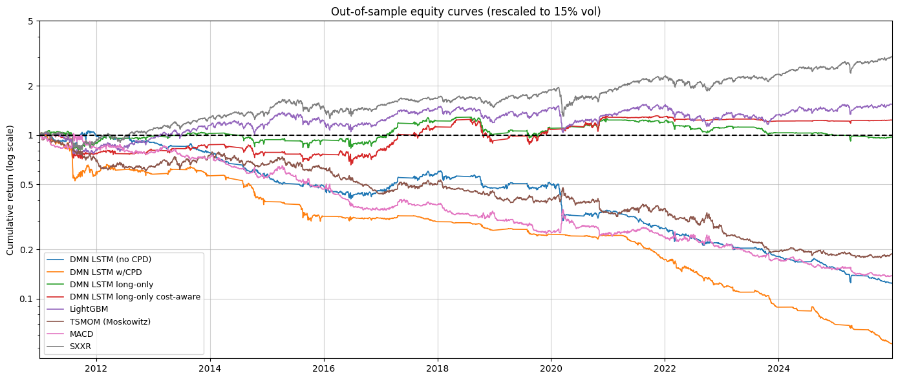

# Slow Momentum with Fast Reversion: STOXX 600 Implementation

A Python implementation and extension of:

> **Wood, K., Roberts, S., & Zohren, S. (2022).**
> *Slow Momentum with Fast Reversion: A Trading Strategy Using Deep Learning and Changepoint Detection.*
> The Journal of Financial Data Science, Winter 2022.

A quantitative research project adapting the paper's methodology from its
original 50-future universe (1990–2020) to the **STOXX 600 equity universe
(2006–2026)**. Beyond the universe change, we extended the original paper
pipeline in multiple directions — most notably a *LightGBM baseline* and a
*cost-aware position-quality-based training objective*.

> *Note:* This is a personal fork of a shared MSc
> project carried out at ESILV in partnership with Pergam, under the
> supervision of Vincent Nazzareno. The team worked from a common scaffold
> (project structure, data pipeline conventions) in a shared repository, and
> each member developed their own implementation branch. This fork preserves
> my individual branch, originally edoardo/submission in the shared
> repository: [VNAZZARENO/Pergam_MSc_2026](https://github.com/VNAZZARENO/Pergam_MSc_2026).

---

## 1. Project context

Time-series momentum strategies exploit the tendency of price trends to persist, but
they react slowly around *momentum turning points* — moments where a trend abruptly
reverses (e.g. the 2020 COVID crash). The paper's answer is to feed an online
**Changepoint Detection (CPD)** signal, built from Gaussian Processes, into a
**Deep Momentum Network (DMN)**: an LSTM trained end-to-end on the (negative)
Sharpe ratio of the resulting position, rather than on a directional forecast.

This repository reproduces that pipeline on European single-stock equities and adds:

- A **LightGBM** alternative to the LSTM, sharing the same feature set and
  evaluation harness, for a tree-based vs. recurrent comparison.
- A **cost-aware training/calibration path** for both models (25 bps transaction
  cost baked into the loss / alpha calibration, not just applied post-hoc at backtest time).
- A **CPD lookback-window sensitivity study** (`lbw ∈ {10, 21, 63, 126, 252}`).
- A **GARCH(1,1) volatility-scaling robustness check** against the default 60-day EWMA.
- Four **changepoint-detection methods compared head-to-head** (Binary Segmentation,
  CUSUM, BOCPD, GP + changepoint kernel) before committing to the GP method used
  in the main pipeline.

## 2. Repository layout

```
.
├── README.md
├── requirements.txt
├── configs/
│   └── default.yaml              # data paths, universe, horizons, DMN/LightGBM/CPD hyperparameters, walk-forward folds
├── documentation/
│   ├── Paper.pdf
│   ├── Slides.pdf          
│   └── figures/
│       ├── EquityCurves.png
|       └── TransactionCostsSensitivity.png                
├── data/                          # gitignored except for READMEs / .gitkeep
│   ├── raw/stoxx600/
│   │   ├── SXXR.xlsx              # Bloomberg pull: stocks, year_by_year, unique_tickers, benchmark sheets
│   │   └── README.md
│   └── processed/
│       ├── stoxx600/              # cleaned panel + benchmarks (stoxx600_processed.csv, benchmark_stoxx600_ew.csv)
│       ├── cpd/                   # precomputed CPD features (cpd_features_lbw{lbw}_s{stride}[_ticker].csv)
│       └── models/                # model checkpoints (.pt / .txt) + OOS predictions (.csv)
├── notebooks/
│   ├── 00_exploration.ipynb                 # data sanity checks, feature/return distributions
│   ├── 01_data_loading.ipynb                # Bloomberg → cleaned long-format panel + features + benchmarks
│   ├── 02_changepoint_detection.ipynb       # 4-method CPD comparison (BinSeg, CUSUM, BOCPD, GP)
│   ├── 03_deep_momentum_network.ipynb       # single-fold LSTM DMN prototype
│   ├── 03_train_lgbm.ipynb                  # LightGBM DMN: 16 annual folds, full walk-forward in one run
│   └── 04_backtest.ipynb                    # walk-forward aggregation, metrics, equity curves, sensitivity
├── scripts/
│   ├── 02_compute_cpd.py                    # precompute GP-CPD features for the full panel (parallelised)
│   ├── 02bis_compute_cpd_single.py          # precompute GP-CPD features for one ticker (fast iteration/testing)
│   ├── 03_train_dmn.py                      # train the LSTM DMN on a single walk-forward fold
│   └── 03bis_walk_forward.py                # orchestrator: runs 03_train_dmn.py (LSTM) across all folds
└── src/
    ├── cpd.py                  # GP Matérn 3/2 + changepoint kernel, plus BinSeg / CUSUM / BOCPD
    ├── dmn.py                  # LSTM DeepMomentumNetwork + Sharpe-ratio loss (cost-aware variant)
    ├── lgbm.py                 # LightGBM DMN: 20 features w/ lag-1, 16 annual folds, alpha calibration, EMA, CPD filter
    ├── sector_mapping.py       # Bloomberg ticker → GICS sector lookup
    └── __init__.py
```

## 3. Data

The only external input is `data/raw/stoxx600/SXXR.xlsx`, a Bloomberg terminal pull
covering 2006–2026 (see `data/raw/stoxx600/README.md` for the sheet layout). It is
gitignored; you'll need your own Bloomberg export to reproduce the pipeline from
scratch. Everything downstream (`data/processed/**`) is generated by the notebooks
and scripts below and is also gitignored, aside from placeholder `.gitkeep` files.

## 4. Setup

```bash
python3 -m venv .venv
source .venv/bin/activate
pip install -r requirements.txt
```

## 5. Reproducing the pipeline

Run in order:

1. **`notebooks/01_data_loading.ipynb`** — loads `SXXR.xlsx`, applies point-in-time
   universe masking, cleans prices (forward-fill + stale-price detection), computes
   returns / volatility / MACD / sector-relative features, builds the SXXR and
   synthetic EW benchmarks, and writes the processed CSVs.
2. **`notebooks/00_exploration.ipynb`** — optional, sanity-checks the processed data 
3. **`notebooks/02_changepoint_detection.ipynb`** — compares four CPD methods on a
   handful of blue-chip stocks against a set of known macro events; used to justify
   the GP + changepoint-kernel method used downstream.
4. **Precompute CPD features for the full panel:**
   ```bash
   python scripts/02_compute_cpd.py --lbw 21 --stride 5
   ```
   (Use `scripts/02bis_compute_cpd_single.py --ticker "TTE FP"` for fast iteration on one ticker.)
5. **Train the LSTM on one fold**, or all folds via the orchestrator:
   ```bash
   # LSTM, paper-style, with CPD
   python scripts/03_train_dmn.py --fold 0 --use-cpd --no-long-only

   # LSTM, all folds, long-only cost-aware
   python scripts/03bis_walk_forward.py --use-cpd --long-only --tc 0.0025
   ```
   `notebooks/03_deep_momentum_network.ipynb` is the single-fold, diagnostics-heavy
   prototype version of the same LSTM training loop used by `scripts/03_train_dmn.py`.

   **LightGBM** trains all 16 annual folds in one pass, directly from the notebook
   (no CLI orchestrator): run `notebooks/03_train_lgbm.ipynb` end to end. It writes
   `positions.parquet` + `fold_metrics.parquet` to `data/processed/stoxx600/`.
6. **`notebooks/04_backtest.ipynb`** — concatenates all folds' out-of-sample
   predictions into a continuous track record, applies transaction costs, computes
   the full performance table (Sharpe, Sortino, Calmar, MDD, hit ratio, …) against
   classical benchmarks (Moskowitz TSMOM, MACD, SXXR), and runs the
   CPD lookback / transaction-cost sensitivity analyses.

## 6. Methodology summary

- **Universe**: STOXX 600 constituents, point-in-time masked year by year to avoid
  survivorship bias (~30–40 intra-year additions/deletions per year are not
  captured — a known, minor approximation, see notebook 01's closing notes).
- **Features**: multi-horizon arithmetic/log returns, 60-day EWMA and rolling
  realised volatility, GARCH(1,1) volatility (robustness check), vol-normalised
  MACD `(8,24) / (16,48) / (32,96)`, sector-relative returns, and GP-CPD
  severity (ν) / location (γ).
- **CPD**: Gaussian Process with a Matérn 3/2 kernel and a sigmoid-blended
  changepoint kernel (Wood, Roberts & Zohren, 2022, Eq. 4–10), benchmarked against
  Binary Segmentation, CUSUM, and BOCPD.
- **Models**: an LSTM DMN (`src/dmn.py`) trained end-to-end on a Sharpe-ratio loss,
  with an optional cost-aware, "trade-quality-weighted" transaction cost term; and
  a LightGBM alternative (`src/lgbm.py`) with 20 features (momentum + CPD, each
  with a lag-1 twin), cross-sectional z-scoring of predictions, post-hoc
  alpha calibration on net Sharpe, EMA position smoothing, and a CPD-based risk
  filter. Unlike the LSTM, LightGBM's positions have no vol-target rescaling.
- **Validation**: the LSTM uses walk-forward, expanding or rolling window
  (configurable in `configs/default.yaml`), three folds spanning 2011–2025
  out-of-sample. LightGBM instead retrains annually on an expanding window,
  16 folds spanning 2011–2026.
- **Costs**: 25 bps applied uniformly at the backtest layer to every strategy,
  regardless of whether it was trained cost-aware, so comparisons stay fair.


## 7. Main results

Full out-of-sample track record (2011–2026 for the DMN variants, 2011–2026 for
LightGBM), net of 25 bps transaction costs applied uniformly to every strategy,
each rescaled to a 15% annualised vol target.

| Strategy | Return | Sharpe | MDD | Hit % | Avg Holding (d) |
| :--- | ---: | ---: | ---: | ---: | ---: |
| DMN LSTM (no CPD) | −15.72% | −1.048 | −88.35% | 43.1% | 1.1 |
| DMN LSTM w/ CPD | −28.43% | −1.896 | −98.89% | 37.6% | 1.1 |
| DMN LSTM long-only | +0.85% | +0.056 | −28.67% | 50.5% | 1.6 |
| DMN LSTM long-only + TC | +3.27% | +0.218 | −35.58% | 51.7% | 2.5 |
| **LightGBM w/ CPD + TC** | **+4.02%** | **+0.268** | −31.48% | **53.70%** | 1.2 |
| TSMOM (Moskowitz) | −9.30% | −0.620 | −82.28% | 51.1% | — |
| MACD | −11.92% | −0.795 | −87.16% | 50.8% | — |
| SXXR (cap-weighted) | +8.46% | +0.564 | −33.45% | 54.2% | — |

The cost-aware objective is what separates the viable strategies from the
rest: the paper-style DMN (short/long, no cost-awareness) collapses under
25 bps of costs regardless of whether CPD is included, while restricting to
long-only and training with the cost-aware objective turns both the LSTM DMN
and LightGBM into net-positive, positive-Sharpe strategies. LightGBM has the
best risk-adjusted and hit-ratio numbers among the active strategies tested,
narrowly ahead of the cost-aware long-only LSTM DMN.

That said, in this table the **passive SXXR benchmark still posts the
highest Sharpe (0.564) and return (+8.46%) of anything tested** — none of
the active strategies beat buy-and-hold net of costs over the full period.
See `notebooks/04_backtest.ipynb` for the regime-dependent breakdown (Sharpe by
year, rolling Sharpe), where the active strategies' relative performance
varies significantly across sub-periods.

### Vol-rescaled equity curves




### Transaction-cost sensitivity


Sharpe ratio as per-transaction cost increases from 0 to 50 bps. The
cost-aware-trained strategies degrade far more gracefully than the naive
DMN, which loses most of its Sharpe within the first few bps — direct
evidence that the cost-aware training objective, not just long-only
restriction, is doing real work.

## 8. Known limitations

- STOXX 600 membership is refreshed once a year (Bloomberg's annual
  `year_by_year` snapshot); intra-year (quarterly) index changes are not captured.
- The 60-day EWMA volatility used for position scaling has a small look-ahead
  (the current day's return carries a small weight in its own vol estimate).
- The GP-CPD lookback sensitivity study shows the four tested windows moving in
  near lock-step across years, suggesting the CPD module adds limited
  incremental signal over the existing momentum/MACD features on single-stock
  equities (see `notebooks/04_backtest.ipynb`, "CPD lookback window sensitivity").
- `lbw=252` cannot be evaluated under the expanding-fold structure (its first
  training window is shorter than the CPD warm-up period); it is only available
  under the rolling-fold structure.

## 9. Tech stack

Python 3.11+, `pandas` / `numpy` / `scipy`, `pytorch` (LSTM DMN), `lightgbm`,
`ruptures` (Binary Segmentation), `arch` (GARCH), `scikit-learn`, `joblib`
(parallel CPD precompute), `pyyaml`. See `requirements.txt`.

## 10. References

Wood, K., Roberts, S., Zohren, S. (2022). *Slow Momentum with Fast Reversion: A
Trading Strategy Using Deep Learning and Changepoint Detection.* The Journal of
Financial Data Science, Winter 2022. See `documentation/paper.pdf`.

Moskowitz, T. J., Ooi, Y. H., & Pedersen, L. H. (2012). *Time series momentum.*
Journal of financial economics, 104(2), 228-250.

Baz, J., Granger, N., Harvey, C. R., Le Roux, N., & Rattray, S. (2015).
*Dissecting investment strategies in the cross section and time series.* 
Available at SSRN: https://ssrn.com/abstract=2695101 or http://dx.doi.org/10.2139/ssrn.2695101